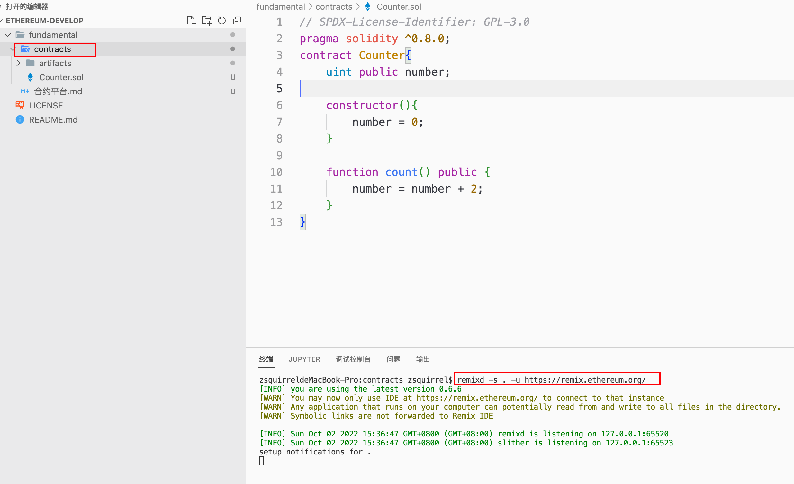
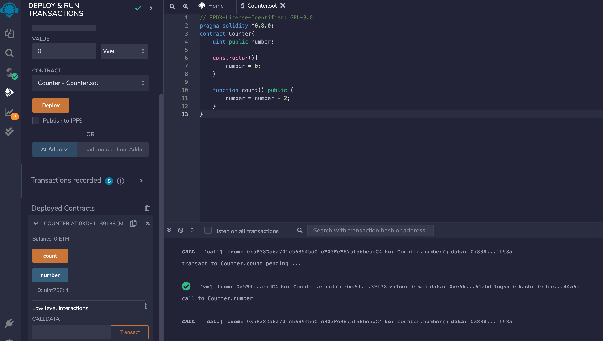
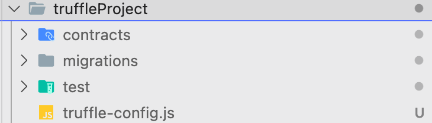
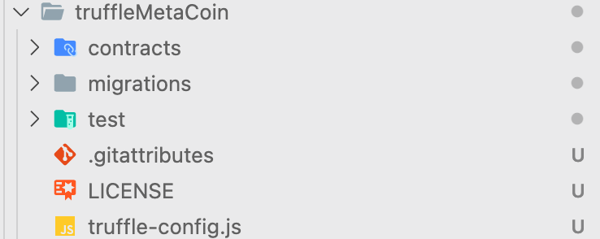
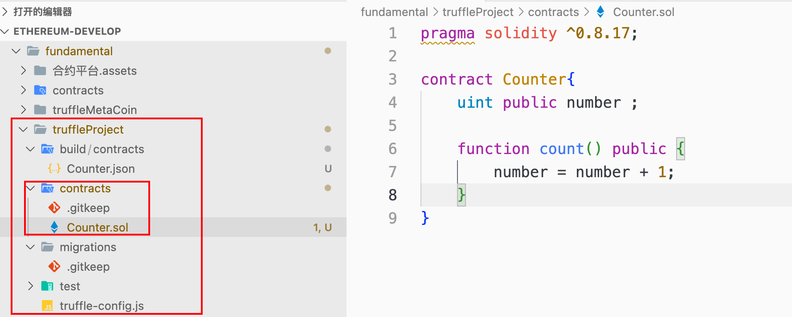
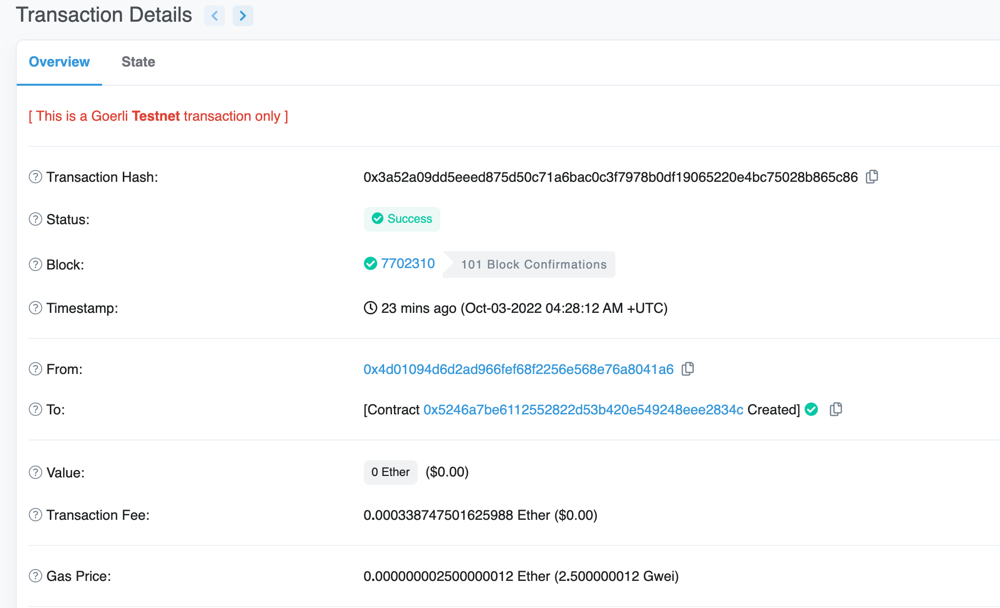

先初步介绍一下几种常用的合约开发平台。

- Remix

  Remix是一个基于浏览器的合约开发、编译、部署环境。一般情况下，在我们开发一些小合约时会使用到。

  其中remix是基于浏览器的，使用时和我们平时的开发习惯或多或少会有一些不一致。如果我们希望从本地读取代码文件，可以安装remixd，相应的指令为：

  ```js
  npm install -g @remix-project/remixd
  ```

  随后将本地的文件和浏览器的remix环境进行共享

  

  


- Truffle + Ganache

  Truffle是一个用于开发以太坊智能合约的系列工具。在智能合约开发时，一般首选truffle和ganache的组合方式。

  相应的官方网站：https://trufflesuite.com/

  **Truffle的使用**

  主要参考官方文档。https://trufflesuite.com/docs/truffle

  ```js
  npm install -g truffle
  
  truffle version
  ```

  通过运行truffle init指令，会初始化一个空白项目。通过运行truffle unbox metacoin会初始化一个特定模板的项目。

  

  

  

  **contracts目录：存放solidity合约文件的目录**

  **migrations目录：存放部署脚本文件的目录**

  **test目录：存放测试脚本文件的目录**

  **truffle-config.js:truffle的配置文件**

  **Truffle生命周期**：

  **truffle compile 编译合约**.编译之后的合约文件会被放置在build/contracts目录中。不要修改该部分数据。

  

  **truffle migrate 部署合约**.

  部署合约需要我们去编写迁移脚本。迁移脚本需要放置在migrations目录下。

  我们在该目录下新建了一个1_counter_migration.js文件

  ```js
  //该行代码表示的是truffle需要和哪些合约进行交互，里面的参数是合约的名称，不是合约文件的名称
  var Counter = artifacts.require('Counter');
  //所有迁移都必须通过module.exports来进行导出。函数第一个参数永远都应该是deployer
  module.exports = function(deployer){
      deployer.deploy(Counter);
  }
  ```

  **truffle test** 测试合约.

  需要在test目录下新建一个测试脚本。测试脚本可以写js、ts等，也可以写成solidity

  ```solidity
  pragma solidity ^0.8.0;
  
  import "truffle/Assert.sol";
  import "truffle/DeployedAddresses.sol";
  import "../contracts/Counter.sol";
  
  contract TestCounter{
  
      function testNumber() public{
      	//DeployedAddresses.Counter()用来获取部署的合约对象
         Counter counter = Counter(DeployedAddresses.Counter());
         //后续断言判断值是否匹配
         Assert.equal(counter.get(), 0, "xxxxx");
      }
  }
  ```

  **truffle提交合约到goerli测试网**

  **1.在truffle-config配置文件中，需要加入如下代码，HDWalletProvider是提供钱包账号，执行交易时需要有私钥进行签名等。.mnemonic是一个助记词文件，利用助记词可以生成对应的账号。如果提示找不到truffle/hdwallet那么需要在truffle所在根目录下执行npm install.**

  ```js
  const HDWalletProvider = require('@truffle/hdwallet-provider');
  const fs = require('fs');
  const mnemonic = fs.readFileSync(".mnemonic").toString().trim();
  ```

  **2.在truffle-config.js文件中，networks需要设置goerli测试网信息。其中goerli测试网的地址需要在https://infura.io/网站注册，不过是免费的。**

  ```js
  /**
   * Use this file to configure your truffle project. It's seeded with some
   * common settings for different networks and features like migrations,
   * compilation, and testing. Uncomment the ones you need or modify
   * them to suit your project as necessary.
   *
   * More information about configuration can be found at:
   *
   * https://trufflesuite.com/docs/truffle/reference/configuration
   * 
   * Hands-off deployment with Infura
   * --------------------------------
   *
   * Do you have a complex application that requires lots of transactions to deploy?
   * Use this approach to make deployment a breeze 🏖️:
   *
   * Infura deployment needs a wallet provider (like @truffle/hdwallet-provider)
   * to sign transactions before they're sent to a remote public node. 
   * Infura accounts are available for free at 🔍: https://infura.io/register
   *
   * You'll need a mnemonic - the twelve word phrase the wallet uses to generate
   * public/private key pairs. You can store your secrets 🤐 in a .env file. 
   * In your project root, run `$ npm install dotenv`. 
   * Create .env (which should be .gitignored) and declare your MNEMONIC 
   * and Infura PROJECT_ID variables inside.
   * For example, your .env file will have the following structure:
   * 
   * MNEMONIC = <Your 12 phrase mnemonic>
   * PROJECT_ID = <Your Infura project id>
   * 
   * Deployment with Truffle Dashboard (Recommended for best security practice)
   * --------------------------------------------------------------------------
   * 
   * Are you concerned about security and minimizing rekt status 🤔?
   * Use this method for best security:
   * 
   * Truffle Dashboard lets you review transactions in detail, and leverages 
   * MetaMask for signing, so there's no need to copy-paste your mnemonic. 
   * More details can be found at 🔎: 
   * 
   * https://trufflesuite.com/docs/truffle/getting-started/using-the-truffle-dashboard/
   */
  
  // require('dotenv').config();
  // const { MNEMONIC, PROJECT_ID } = process.env;
  
  const HDWalletProvider = require('@truffle/hdwallet-provider');
  const fs = require('fs');
  const mnemonic = fs.readFileSync(".mnemonic").toString().trim();
  
  module.exports = {
    /**
     * Networks define how you connect to your ethereum client and let you set the
     * defaults web3 uses to send transactions. If you don't specify one truffle
     * will spin up a managed Ganache instance for you on port 9545 when you
     * run `develop` or `test`. You can ask a truffle command to use a specific
     * network from the command line, e.g
     *
     * $ truffle test --network <network-name>
     */
  
    networks: {
      // Useful for testing. The `development` name is special - truffle uses it by default
      // if it's defined here and no other network is specified at the command line.
      // You should run a client (like ganache, geth, or parity) in a separate terminal
      // tab if you use this network and you must also set the `host`, `port` and `network_id`
      // options below to some value.
      //
      // development: {
      //  host: "127.0.0.1",     // Localhost (default: none)
      //  port: 8545,            // Standard Ethereum port (default: none)
      //  network_id: "*",       // Any network (default: none)
      // },
      //
      // An additional network, but with some advanced options…
      // advanced: {
      //   port: 8777,             // Custom port
      //   network_id: 1342,       // Custom network
      //   gas: 8500000,           // Gas sent with each transaction (default: ~6700000)
      //   gasPrice: 20000000000,  // 20 gwei (in wei) (default: 100 gwei)
      //   from: <address>,        // Account to send transactions from (default: accounts[0])
      //   websocket: true         // Enable EventEmitter interface for web3 (default: false)
      // },
      //
      // Useful for deploying to a public network.
      // Note: It's important to wrap the provider as a function to ensure truffle uses a new provider every time.
      goerli: {
        provider: () => new HDWalletProvider(mnemonic, `https://goerli.infura.io/v3/11cea8aafae6482b864a6c85b9cbe6e7`),
        network_id: 5,       // Goerli's id
        confirmations: 2,    // # of confirmations to wait between deployments. (default: 0)
        timeoutBlocks: 200,  // # of blocks before a deployment times out  (minimum/default: 50)
        skipDryRun: true     // Skip dry run before migrations? (default: false for public nets )
      }
      //
      // Useful for private networks
      // private: {
      //   provider: () => new HDWalletProvider(MNEMONIC, `https://network.io`),
      //   network_id: 2111,   // This network is yours, in the cloud.
      //   production: true    // Treats this network as if it was a public net. (default: false)
      // }
    },
  
    // Set default mocha options here, use special reporters, etc.
    mocha: {
      // timeout: 100000
    },
  
    // Configure your compilers
    compilers: {
      solc: {
        version: "0.8.17",      // Fetch exact version from solc-bin (default: truffle's version)
        // docker: true,        // Use "0.5.1" you've installed locally with docker (default: false)
        // settings: {          // See the solidity docs for advice about optimization and evmVersion
        //  optimizer: {
        //    enabled: false,
        //    runs: 200
        //  },
        //  evmVersion: "byzantium"
        // }
      }
    },
  
    // Truffle DB is currently disabled by default; to enable it, change enabled:
    // false to enabled: true. The default storage location can also be
    // overridden by specifying the adapter settings, as shown in the commented code below.
    //
    // NOTE: It is not possible to migrate your contracts to truffle DB and you should
    // make a backup of your artifacts to a safe location before enabling this feature.
    //
    // After you backed up your artifacts you can utilize db by running migrate as follows:
    // $ truffle migrate --reset --compile-all
    //
    // db: {
    //   enabled: false,
    //   host: "127.0.0.1",
    //   adapter: {
    //     name: "sqlite",
    //     settings: {
    //       directory: ".db"
    //     }
    //   }
    // }
  };
  ```

  **3.执行指令 truffle migrate --network goerli**.确保填入的助记词账号中有goerli测试网的eth。如下图所示。

  

- Hardhat

  Hardhat也是一个用于开发、部署、测试智能合约的平台工具。

  https://hardhat.org/

